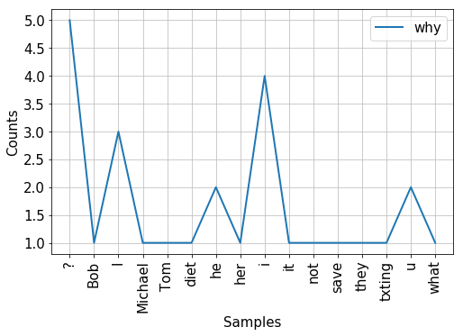
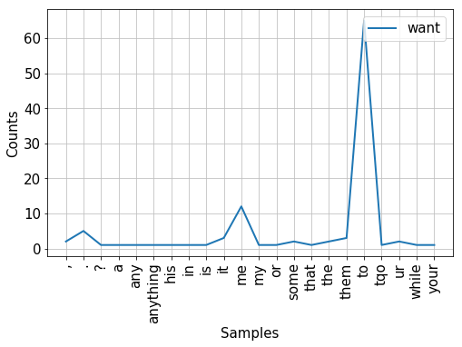

Importing libraries: pandas and nltk (natural language toolkit). Tokenize is used to split text into words. Matplotlib for plotting.


```python
import pandas as pd
import nltk
import matplotlib.pyplot as plt
from nltk import tokenize
```


```python
smsDF = pd.read_csv('textMessageCorpus.csv',delimiter='\t')
```

Let's take a look at the data:


```python
smsDF.head()
```


<div>
<style scoped>
    .dataframe tbody tr th:only-of-type {
        vertical-align: middle;
    }

    .dataframe tbody tr th {
        vertical-align: top;
    }

    .dataframe thead th {
        text-align: right;
    }
</style>
<table border="1" class="dataframe">
  <thead>
    <tr style="text-align: right;">
      <th></th>
      <th>class</th>
      <th>subscriber</th>
      <th>message_body</th>
      <th>timestamp</th>
      <th>type</th>
    </tr>
  </thead>
  <tbody>
    <tr>
      <th>0</th>
      <td>0</td>
      <td>1</td>
      <td>Hey sir I have a question on software I am doi...</td>
      <td>4/4/11 14:40</td>
      <td>Incoming</td>
    </tr>
    <tr>
      <th>1</th>
      <td>0</td>
      <td>1</td>
      <td>s the same guys name as the first but it will ...</td>
      <td>4/4/11 14:40</td>
      <td>Incoming</td>
    </tr>
    <tr>
      <th>2</th>
      <td>0</td>
      <td>1</td>
      <td>thing that I have to do to allow me to do it</td>
      <td>4/4/11 14:40</td>
      <td>Incoming</td>
    </tr>
    <tr>
      <th>3</th>
      <td>0</td>
      <td>1</td>
      <td>The identity field must be unique, but you can...</td>
      <td>4/4/11 14:41</td>
      <td>Outgoing</td>
    </tr>
    <tr>
      <th>4</th>
      <td>0</td>
      <td>1</td>
      <td>Ok thank u sir</td>
      <td>4/4/11 14:42</td>
      <td>Incoming</td>
    </tr>
  </tbody>
</table>
</div>


We can now create a new column where the text messages are tokenized by words


```python
# create a tokenized column
smsDF['tokenized'] = smsDF['message_body'].apply(lambda row: nltk.word_tokenize(row))
```

Looking at the column of tokens we get the following:


```python
smsDF['tokenized'].head()
```


    0    [Hey, sir, I, have, a, question, on, software,...
    1    [s, the, same, guys, name, as, the, first, but...
    2    [thing, that, I, have, to, do, to, allow, me, ...
    3    [The, identity, field, must, be, unique, ,, bu...
    4                                  [Ok, thank, u, sir]
    Name: tokenized, dtype: object


And now we create a column of bigrams on a per text message basis:


```python
smsDF['bigrams'] = smsDF['tokenized'].apply(lambda row: nltk.bigrams(row))
# compile list of bigrams
bigramsList = []
for bigramObj in smsDF.bigrams:
    for bigram in list(bigramObj):
        bigramsList.append(bigram)
```

Let's take a look at the first five elements of the bigrams


```python
print(bigramsList[0:5])
```

    [('Hey', 'sir'), ('sir', 'I'), ('I', 'have'), ('have', 'a'), ('a', 'question')]


We see that we have a list of pairs of words. The first word is the condition while the second word is the outcome. Now, we create a conditional frequency distribution.


```python
cfd = nltk.ConditionalFreqDist(bigramsList)
```

We can plot the numer of occurrences of different word outcomes after inputing the word "why"


```python
plt.figure(figsize=(8, 5))
plt.rcParams.update({'font.size':15})
cfd.plot(conditions=['why'])
```





We see that the most common occurrence is the question mark "?" followed by the word "I" or "i","u", and "he." Looking at the probability distribution conditional on the word "want" we get that the most common outcome is "to" followed by "me".


```python
plt.figure(figsize=(8, 5))
cfd.plot(conditions=['want'])
```





Next, we define a function to suggest the next word with the associated conditional probability, given the previous word:


```python
def suggestWord(previousWord, nSuggestions):
    common=cfd[previousWord].most_common(n=nSuggestions)
    n = min(len(cfd[previousWord]),nSuggestions)
    for i in range(n):
        word = common[i][0]
        total = sum(cfd[previousWord].values())
        counts = common[i][1]
        print(word + ': ' + str(round(counts/total,2)))
    
```

Let's try obtaining suggestions for some common use cases:


```python
suggestWord('get',5)
```

    a: 0.08
    it: 0.07
    in: 0.06
    there: 0.05
    off: 0.04


```python
suggestWord('try',3)
```

    to: 0.5
    it: 0.11
    and: 0.11


```python
suggestWord('come',4)
```

    over: 0.12
    out: 0.09
    by: 0.08
    up: 0.07


```python
suggestWord('please',3)
```

    .: 0.3
    return: 0.15
    send: 0.1


```python
suggestWord('would',4)
```

    be: 0.13
    like: 0.13
    you: 0.1
    have: 0.09


```python
suggestWord('love',4)
```

    you: 0.26
    u: 0.23
    and: 0.1
    your: 0.05


We can also try to predict a phrase by sugesting the next word, selecting the word with highest likelyhood, and using it as the condition for the following word, and so on in a loop. Here, we create function to output a suggested phrase:


```python
def suggestPhrase(cfdist, word, num=4):
    for i in range(num):
        print(word, end=' ')
        word = cfdist[word].max()
    print()
```

Let's try it with the words "I" and "please"


```python
suggestPhrase(cfd,'I',num=4)
suggestPhrase(cfd,'Please',num=4)
```

    I am going to 
    Please let me . 


Of course, this model is too crude for longer predictions, as we can see when we try to predict many words:


```python
suggestPhrase(cfd,'Please',num=10)
```

    Please let me . I am going to get a 


This concludes our simple next-word prediction model. We could improve on this simple system by collecting more data and possibly by using words that occur earlier in the sentence as conditions as well.


Image credit: By Chris.rider81 - Own work, CC BY-SA 3.0, https://commons.wikimedia.org/w/index.php?curid=20601766